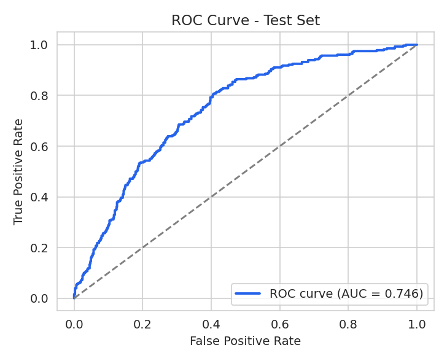
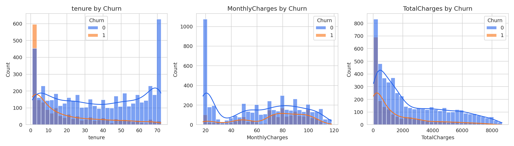
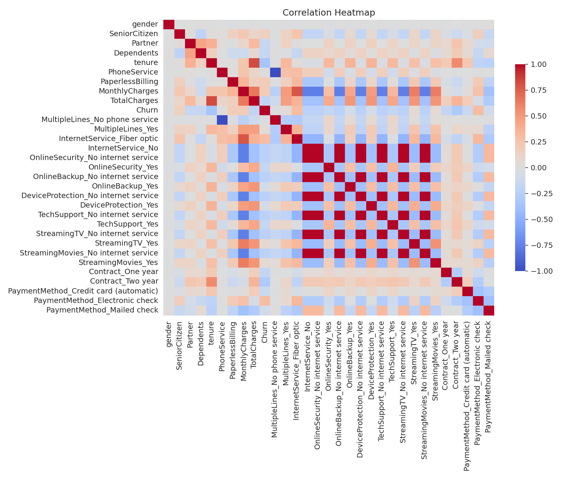

<div align="center">

# 📉 Churn Radar
### *AI-Powered Customer Churn Prediction, Built on PyTorch*


<br>

[](https://www.python.org/)
[](https://pytorch.org/)
[](https://streamlit.io/)
[](https://scikit-learn.org/)
[](#-disclaimer)

<br>
<br>

<!-- ======================= LIVE DEMO — CLICK HERE ======================= -->
<a href="https://customer-churn-prediction-pytorch.streamlit.app/">
  
</a>

### 👆 **THAT'S THE LIVE APP — CLICK THE BLUE BUTTON ABOVE** 👆
#### 🔗 Or use the direct link: **[customer-churn-prediction-pytorch.streamlit.app](https://customer-churn-prediction-pytorch.streamlit.app/)**
<!-- ======================================================================= -->

<br>


</div>

---

## ✨ What Is This?

**Churn Radar** is an end-to-end deep learning project that predicts whether a telecom customer is about to **churn** (cancel their subscription), using a custom **PyTorch** Artificial Neural Network trained on the classic Telco Customer Churn dataset — wrapped in a clean, light-themed **Streamlit** app for real-time scoring.

> 💡 **TL;DR** — Fill in a customer's account details, get an instant churn-risk score. Retention teams can use this to step in *before* the customer leaves.

**Task type:** Binary classification (`Churn`: `1` = churns, `0` = stays)

<br>

## 🎯 Key Highlights

<table>
<tr>
<td width="50%" valign="top">

### 🧠 Smart Modeling
- Custom **PyTorch** feed-forward neural network
- `19 → 64 → 32 → 16 → 1` architecture with ReLU activations
- `BCEWithLogitsLoss` + `pos_weight` to correct for class imbalance
- Adam optimizer · `lr = 1e-3` · batch size `64`

</td>
<td width="50%" valign="top">

### 💼 Business-Driven
- Built around a real retention use case: acquiring customers costs far more than keeping them
- Flags at-risk customers from contract type, tenure, billing & services
- Clean light-themed Streamlit UI, ready to deploy in one click

</td>
</tr>
</table>

<br>

## 📊 Model Performance

<div align="center">

| Metric | Score |
|:---:|:---:|
| **Accuracy** | `70.3%` |
| **Precision** | `45.7%` |
| **Recall** | `62.5%` |
| **F1 Score** | `52.8%` |
| **ROC-AUC** | `0.747` |

</div>

> ⚠️ **Honest read:** Churn only affects ~27% of customers, so accuracy alone tells an incomplete story. The model is deliberately tuned (via `pos_weight`) to favor **recall on churners** — catching a customer who's about to leave matters more than a perfect accuracy score. Metrics are from the reference run in `models/metrics.json`; re-run `python src/train.py` to reproduce or improve on them.

<br>

<div align="center">


</div>

<br>

## 🖼️ Exploratory Data Analysis

<div align="center">





</div>

**Key findings:**
- 📅 `tenure` is the strongest signal — churners tend to be much newer customers
- 💳 `MonthlyCharges` skews higher for churners; `TotalCharges` skews lower (they leave before charges add up)
- 📄 `Month-to-month` contracts churn far more than one/two-year contracts — no lock-in makes leaving easy
- 🌐 `Fiber optic` internet customers churn more than DSL customers

<br>

## 🧩 Architecture

```
Input (19 features)
        │
   ┌────▼────┐
   │ Linear  │  19 → 64
   │  ReLU   │
   └────┬────┘
   ┌────▼────┐
   │ Linear  │  64 → 32
   │  ReLU   │
   └────┬────┘
   ┌────▼────┐
   │ Linear  │  32 → 16
   │  ReLU   │
   └────┬────┘
   ┌────▼────┐
   │ Linear  │  16 → 1  (churn logit)
   └─────────┘
```

**Features used:** `gender` · `SeniorCitizen` · `Partner` · `Dependents` · `tenure` · `PhoneService` · `MultipleLines` · `InternetService` · `OnlineSecurity` · `OnlineBackup` · `DeviceProtection` · `TechSupport` · `StreamingTV` · `StreamingMovies` · `Contract` · `PaperlessBilling` · `PaymentMethod` · `MonthlyCharges` · `TotalCharges`

*(`customerID` is dropped — pure identifier, no predictive value.)*

<br>

## ⚡ Quick Start

### 🔧 Run Locally

```bash
git clone <this-repo-url>
cd "Customer Churn Prediction"
pip install -r requirements.txt
streamlit run app.py
```

The app ships with an already-trained model in `models/`, so it works right away — retraining is optional.

### 🔁 Retrain From Scratch

```bash
python src/train.py
```

### ☁️ Deploy on Streamlit Community Cloud

1. Push this folder to a GitHub repo
2. Go to [share.streamlit.io](https://share.streamlit.io) → **New app**
3. Point it at your repo/branch, set main file to **`app.py`**
4. Hit **Deploy** — `requirements.txt` and `.streamlit/config.toml` (pinned light theme) are already configured ✅

<br>

## 📁 Project Structure

```
Customer Churn Prediction/
├── app.py                   # 🎛️  Single-file Streamlit app — UI + model + inference
├── requirements.txt         # 📦  Dependencies
├── .streamlit/config.toml   # ☀️  Light theme config
├── data/                    # 🗃️  Raw + cleaned/scaled datasets
├── models/                  # 🧠  Trained weights + scaler + feature order + metrics
├── images/                  # 📊  EDA & evaluation charts
├── notebooks/                # 📓  Full training notebook (EDA + encoding + training)
└── src/                     # 🛠️  Modular pipeline
    ├── model.py              #     PyTorch ANN architecture
    ├── preprocessing.py       #     Raw input → model-ready row
    ├── train.py               #     Full training pipeline
    └── infer.py                #     Loads saved artifacts + predict()
```

<br>

## 🛠️ Tech Stack

<div align="center">

`PyTorch` &nbsp;·&nbsp; `Scikit-learn` &nbsp;·&nbsp; `Pandas` &nbsp;·&nbsp; `NumPy` &nbsp;·&nbsp; `Streamlit` &nbsp;·&nbsp; `Matplotlib` &nbsp;·&nbsp; `Seaborn` &nbsp;·&nbsp; `Joblib`

</div>

<br>

## 🚧 Future Improvements

- 🌲 Try tree-based baselines (XGBoost/LightGBM) as a sanity-check comparison against the ANN
- 🔍 Add SHAP-based feature importance / explainability to the app
- 🔁 k-fold cross-validation instead of a single train/valid/test split
- 🎚️ Tune the classification threshold instead of the default `0.5` — recall on churners matters more than raw accuracy here

<br>

## 📚 Dataset

Sourced from the classic **Telco Customer Churn dataset** (`data/Telco-Customer-Churn.csv`) — ~7,032 rows (after dropping missing `TotalCharges`), 19 features, ~73% stay vs 27% churn.

<br>

## ⚠️ Disclaimer

> This model is a **screening tool built for a data science portfolio**, not a production-grade retention system. Predictions should be treated as a starting point for a human decision, not a final verdict on any customer.

<br>

---

<div align="center">

### 🌟 If you found this project interesting, consider giving it a star!

### 🚀 **[→ Try the Live App Here ←](https://customer-churn-prediction-pytorch.streamlit.app/)**


**Made with 🧠 PyTorch, ☕ persistence, and a lot of 📉 imbalanced data**

</div>
